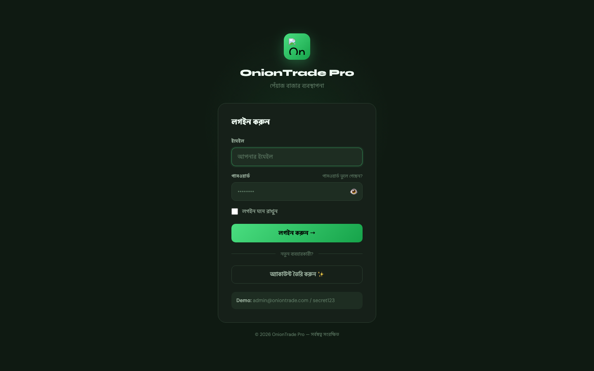
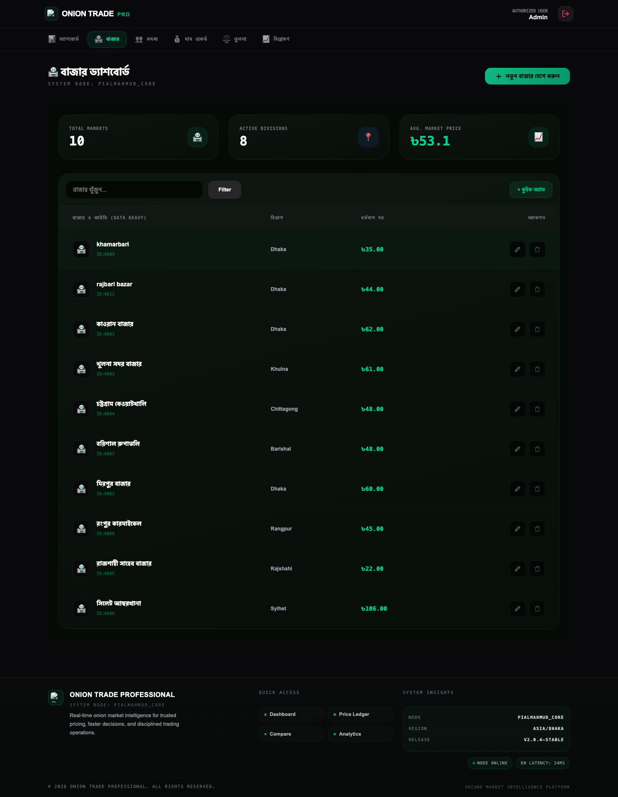
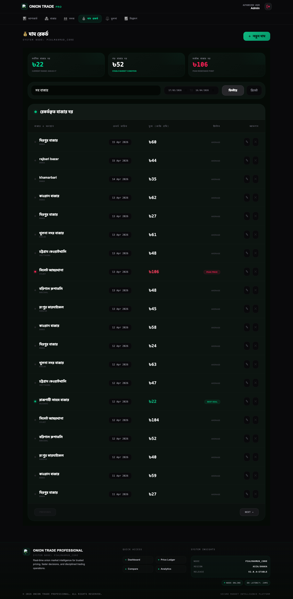
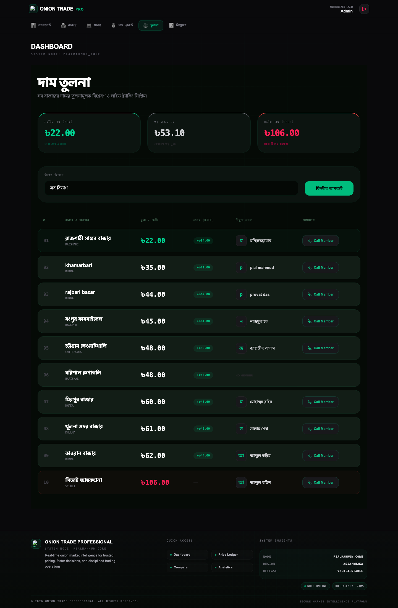
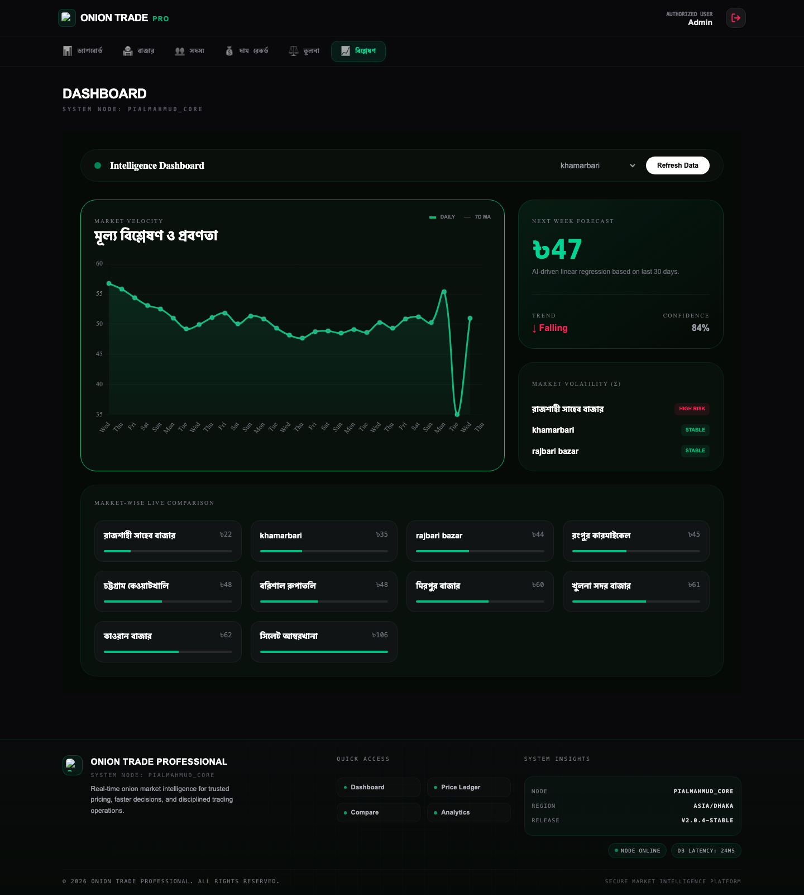

# OnionTrade Pro

Professional onion market price intelligence platform built with Laravel + Vite.

## Overview
OnionTrade Pro is a production-ready web application for tracking, recording, comparing, and analyzing onion prices across multiple markets.

It includes:
- Market management
- Member (field agent) management
- Daily price recording
- Market comparison dashboard
- Analytics and forecasting view
- Authentication with password reset

## Core Features
- `Dashboard`: quick snapshot of average price, trend, ticker, and market cards
- `Markets`: CRUD, market profile view, document upload/download
- `Members`: CRUD with market assignment and status
- `Prices`: record, update, filter by market/date range, and list history
- `Compare`: side-by-side market price comparison with best/worst indicators
- `Analytics`: trend visualization and forecast-oriented insight cards
- `Auth`: login, register, forgot password, reset password

## Tech Stack
- `Backend`: Laravel 13, PHP 8.3+
- `Frontend`: Blade, TailwindCSS (via Vite), Alpine.js
- `Build`: Vite 8
- `Database`: MySQL (or Laravel-supported SQL drivers)

## Project Structure
- `app/Http/Controllers/Api` - feature controllers
- `app/Models` - Eloquent models
- `resources/views` - Blade templates
- `routes/web.php` - web routes
- `public/brand` - application icon assets (SVG/PNG/ICO)

## Requirements
- PHP `^8.3`
- Composer
- Node.js + npm
- Database server (MySQL recommended)

## Local Setup
1. Clone and enter the project:
```bash
git clone <your-repo-url>
cd onion-trading-app
```

2. Install backend dependencies:
```bash
composer install
```

3. Create environment file and app key:
```bash
cp .env.example .env
php artisan key:generate
```

4. Configure database in `.env`, then run migrations:
```bash
php artisan migrate
```

5. Install frontend dependencies:
```bash
npm install
```

6. Build frontend assets:
```bash
npm run build
```

7. Start the app:
```bash
php artisan serve
```

Open: `http://127.0.0.1:8000`


## Endpoint Table

The app uses web routes (session-authenticated) and resource-style endpoints.

| Method | URI | Name | Controller Action | Access |
|---|---|---|---|---|
| GET | `/` | `dashboard` | `DashboardController@index` | Auth |
| GET | `/login` | `login` | `AuthController@showLogin` | Guest |
| POST | `/login` | `login.post` | `AuthController@login` | Guest |
| POST | `/logout` | `logout` | `AuthController@logout` | Auth |
| GET | `/register` | `register` | `AuthController@showRegister` | Guest |
| POST | `/register` | `register.post` | `AuthController@register` | Guest |
| GET | `/forgot-password` | `password.request` | `AuthController@showForgotPassword` | Guest |
| POST | `/forgot-password` | `password.email` | `AuthController@sendResetLink` | Guest |
| GET | `/reset-password/{token}` | `password.reset` | `AuthController@showResetPassword` | Guest |
| POST | `/reset-password` | `password.update` | `AuthController@resetPassword` | Guest |
| GET | `/markets` | `markets.index` | `MarketController@index` | Auth |
| GET | `/markets/create` | `markets.create` | `MarketController@create` | Auth |
| POST | `/markets` | `markets.store` | `MarketController@store` | Auth |
| GET | `/markets/{market}` | `markets.show` | `MarketController@show` | Auth |
| GET | `/markets/{market}/edit` | `markets.edit` | `MarketController@edit` | Auth |
| PUT | `/markets/{market}` | `markets.update` | `MarketController@update` | Auth |
| DELETE | `/markets/{market}` | `markets.destroy` | `MarketController@destroy` | Auth |
| POST | `/markets/{market}/documents` | `markets.documents.store` | `MarketController@storeDocument` | Auth |
| GET | `/documents/download/{id}` | `documents.download` | `MarketController@downloadDocument` | Auth |
| DELETE | `/documents/{id}` | `documents.destroy` | `MarketController@destroyDocument` | Auth |
| GET | `/members` | `members.index` | `MemberController@index` | Auth |
| GET | `/members/create` | `members.create` | `MemberController@create` | Auth |
| POST | `/members` | `members.store` | `MemberController@store` | Auth |
| GET | `/members/{member}/edit` | `members.edit` | `MemberController@edit` | Auth |
| PUT/PATCH | `/members/{member}` | `members.update` | `MemberController@update` | Auth |
| DELETE | `/members/{member}` | `members.destroy` | `MemberController@destroy` | Auth |
| GET | `/prices` | `prices.index` | `PriceController@index` | Auth |
| GET | `/prices/create` | `prices.create` | `PriceController@create` | Auth |
| POST | `/prices` | `prices.store` | `PriceController@store` | Auth |
| GET | `/prices/{price}/edit` | `prices.edit` | `PriceController@edit` | Auth |
| PUT/PATCH | `/prices/{price}` | `prices.update` | `PriceController@update` | Auth |
| DELETE | `/prices/{price}` | `prices.destroy` | `PriceController@destroy` | Auth |
| GET | `/compare` | `compare.index` | `CompareController@index` | Auth |
| GET | `/analytics` | `analytics.index` | `AnalyticsController@index` | Auth |
| GET | `/plans` | `plans` | Closure view | Auth |
| GET | `/settings` | `settings` | Closure view | Auth |

## Screenshots

### Dashboard


### Login


### Markets


### Prices


### Compare


### Analytics


## Development Commands
- Start Vite dev server:
```bash
npm run dev
```

- Build assets for production:
```bash
npm run build
```

- Run tests:
```bash
php artisan test
```

- List routes:
```bash
php artisan route:list
```

## Authentication Notes
- If no user exists, register from `/register`
- Password reset flow is available from `/forgot-password`

## Branding Assets
App icons are available in:
- `public/favicon.ico` (multi-size ICO)
- `public/brand/oniontrade-icon.svg`
- `public/brand/oniontrade-icon-*.png` (multiple sizes)

## Troubleshooting
### 1) Vite manifest not found
Error:
`Vite manifest not found at public/build/manifest.json`

Fix:
```bash
npm install
npm run build
```

### 2) Styles/JS not updating
```bash
php artisan optimize:clear
npm run dev
```

### 3) Login fails unexpectedly
- Confirm email/password
- Reset password via forgot-password flow
- Ensure `APP_URL` and session settings are correct in `.env`

## Security
- Do not commit `.env`
- Rotate passwords in non-local environments
- Use HTTPS in production

## License
This project is licensed under the MIT License.
